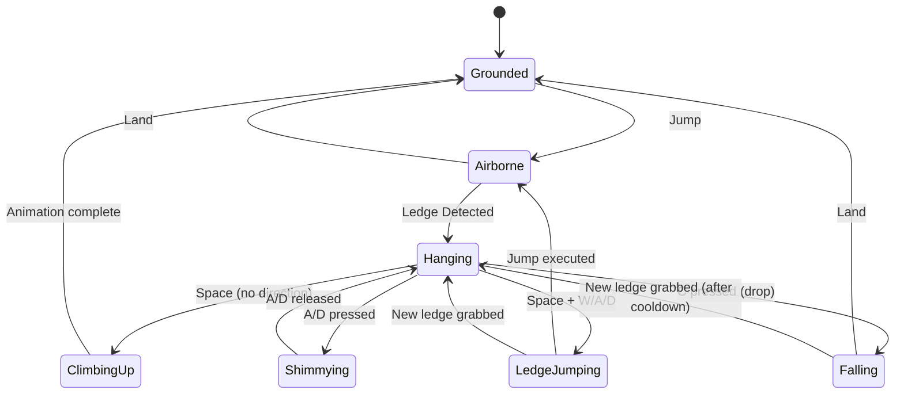
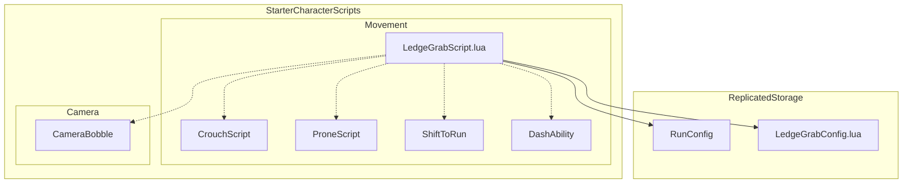

# Design Document: Ledge Grab System

## Overview

Система Ledge Grab добавляет механику цепляния за края блоков в Roblox-игру. Система интегрируется с существующей архитектурой движения (RunConfig, CrouchScript, ProneScript) и работает как LocalScript в StarterCharacterScripts/Movement.

Основные возможности:
- Автоматическое обнаружение краёв через Raycast/Spherecast
- Состояние виса с блокировкой других механик движения
- Shimmy (перемещение вдоль края)
- Climb Up (забирание наверх)
- Ledge Jump (прыжок с виса на другой край)
- Звуковые эффекты и анимации

## Architecture



### System Integration



## Components and Interfaces

### 1. LedgeGrabConfig (ModuleScript)

Конфигурационный модуль в ReplicatedStorage для настройки параметров системы.

```lua
local LedgeGrabConfig = {}

-- Detection Settings
LedgeGrabConfig.HorizontalDetectionRange = 2    -- studs
LedgeGrabConfig.VerticalDetectionRange = 1      -- studs above head
LedgeGrabConfig.MinLedgeWidth = 1               -- minimum grabbable surface width

-- Movement Settings
LedgeGrabConfig.ShimmySpeed = 3                 -- studs per second
LedgeGrabConfig.ClimbUpDuration = 0.5           -- seconds
LedgeGrabConfig.LedgeJumpForce = 20             -- studs per second
LedgeGrabConfig.DropCooldown = 0.5              -- seconds

-- State Flags (runtime)
LedgeGrabConfig.IsHanging = false
LedgeGrabConfig.IsClimbingUp = false
LedgeGrabConfig.IsShimmying = false
LedgeGrabConfig.CanGrab = true

-- Animation IDs (placeholder - replace with actual IDs)
LedgeGrabConfig.HangIdleAnimId = "rbxassetid://0"
LedgeGrabConfig.ShimmyLeftAnimId = "rbxassetid://0"
LedgeGrabConfig.ShimmyRightAnimId = "rbxassetid://0"
LedgeGrabConfig.ClimbUpAnimId = "rbxassetid://0"

-- Sound IDs (placeholder - replace with actual IDs)
LedgeGrabConfig.GrabSoundId = "rbxassetid://0"
LedgeGrabConfig.ClimbSoundId = "rbxassetid://0"
LedgeGrabConfig.DropSoundId = "rbxassetid://0"
LedgeGrabConfig.ShimmySoundId = "rbxassetid://0"

return LedgeGrabConfig
```

### 2. LedgeGrabScript (LocalScript)

Основной скрипт системы с следующими компонентами:

#### 2.1 Ledge Detection Module

```lua
-- Обнаружение края через два raycast:
-- 1. Горизонтальный ray вперёд от груди (проверка стены)
-- 2. Вертикальный ray вниз от точки выше головы (проверка верхней поверхности)

function detectLedge(): LedgeData | nil
    -- Returns: { position: Vector3, normal: Vector3, part: BasePart } or nil
end
```

#### 2.2 State Manager

```lua
-- Управление состояниями: Airborne, Hanging, Shimmying, ClimbingUp, LedgeJumping
-- Блокировка других систем движения при входе в Hang State
-- Восстановление систем при выходе

function enterHangState(ledgeData: LedgeData): void
function exitHangState(): void
function disableMovementSystems(): void
function enableMovementSystems(): void
```

#### 2.3 Movement Controller

```lua
-- Управление позицией игрока во время виса
-- Shimmy движение вдоль края
-- Climb Up последовательность
-- Ledge Jump механика

function updateHangPosition(ledgeData: LedgeData): void
function performShimmy(direction: number): void  -- -1 left, 1 right
function performClimbUp(): void
function performLedgeJump(direction: Vector3): void
```

#### 2.4 Animation Controller

```lua
-- Загрузка и воспроизведение анимаций
-- Синхронизация с состояниями

function playHangIdle(): void
function playShimmy(direction: number): void
function playClimbUp(): void
function stopAllLedgeAnimations(): void
```

#### 2.5 Sound Controller

```lua
-- Воспроизведение звуковых эффектов

function playGrabSound(): void
function playClimbSound(): void
function playDropSound(): void
function playShimmySound(): void
```

### 3. Interface with Existing Systems

#### RunConfig Integration

```lua
-- Добавить в RunConfig:
RunConfig.IsHanging = false  -- Флаг состояния виса

-- LedgeGrabScript проверяет и устанавливает:
-- - RunConfig.Running = false при входе в Hang State
-- - RunConfig.CanRun = false при входе в Hang State
-- - Восстановление при выходе
```

#### CrouchScript Integration

```lua
-- LedgeGrabScript проверяет:
-- - Не активировать ledge grab если isCrouching == true
-- - Установить isCrouching.Value = false при входе в Hang State
```

#### ProneScript Integration

```lua
-- LedgeGrabScript проверяет:
-- - Не активировать ledge grab если RunConfig.isProne == true
```

## Data Models

### LedgeData

```lua
type LedgeData = {
    position: Vector3,      -- Позиция края (точка захвата)
    normal: Vector3,        -- Нормаль поверхности стены (направление от стены)
    surfaceTop: Vector3,    -- Позиция верхней поверхности
    part: BasePart,         -- Часть, к которой принадлежит край
    width: number,          -- Ширина доступной поверхности для shimmy
    leftBound: Vector3,     -- Левая граница края
    rightBound: Vector3     -- Правая граница края
}
```

### HangState

```lua
type HangState = {
    isActive: boolean,
    currentLedge: LedgeData | nil,
    hangStartTime: number,
    lastShimmyDirection: number,  -- -1, 0, 1
    canClimbUp: boolean,
    bodyPosition: BodyPosition,   -- Roblox constraint
    bodyGyro: BodyGyro            -- Roblox constraint for rotation
}
```


## Correctness Properties

*A property is a characteristic or behavior that should hold true across all valid executions of a system-essentially, a formal statement about what the system should do. Properties serve as the bridge between human-readable specifications and machine-verifiable correctness guarantees.*

### Property 1: Ledge Detection Range

*For any* player position in the air and any valid ledge, if the player is within 2 studs horizontally and 1 stud vertically of the ledge, then detectLedge() SHALL return valid LedgeData; otherwise it SHALL return nil.

**Validates: Requirements 1.1, 6.1**

### Property 2: Velocity Reset on Hang

*For any* transition into Hang State, the player's velocity (both horizontal and vertical components) SHALL become zero within one frame of entering the state.

**Validates: Requirements 1.2**

### Property 3: Grounded State Blocks Detection

*For any* player state where the player is grounded, crouching, or prone, the detectLedge() function SHALL return nil regardless of nearby ledges.

**Validates: Requirements 1.4**

### Property 4: Climb Up Positioning

*For any* successful climb up sequence, the player's final position SHALL be on top of the ledge surface (Y coordinate >= ledge surface Y coordinate).

**Validates: Requirements 2.3**

### Property 5: State Exit Restores Controls

*For any* exit from Hang State (via climb up, drop, or ledge jump), all movement abilities (running, crouching, prone, dash) SHALL be re-enabled to their pre-hang values.

**Validates: Requirements 2.4, 4.2, 6.4**

### Property 6: Shimmy Direction and Speed

*For any* shimmy input (A or D) while in Hang State, the player SHALL move along the ledge in the corresponding direction (A = left relative to facing, D = right) at exactly 3 studs per second.

**Validates: Requirements 3.1, 3.2, 3.5**

### Property 7: Drop Cooldown

*For any* drop from a ledge, the CanGrab flag SHALL be false for exactly 0.5 seconds, after which it SHALL become true.

**Validates: Requirements 4.3**

### Property 8: Ledge Jump Direction and Force

*For any* ledge jump with directional input (W, A, or D held with Space), the player SHALL be launched in the corresponding direction with a velocity magnitude of 20 studs per second.

**Validates: Requirements 5.1, 5.2, 5.3, 5.4**

### Property 9: Hang State Disables Movement

*For any* entry into Hang State, the following flags SHALL be set: RunConfig.CanRun = false, RunConfig.Running = false, IsCrouching = false, and dash ability disabled.

**Validates: Requirements 6.3**

## Error Handling

| Error Condition | Handling Strategy |
|-----------------|-------------------|
| No valid ledge found during detection | Return nil, player continues normal movement |
| Obstruction above ledge during climb up | Keep player in Hang State, optionally show UI feedback |
| Ledge part destroyed while hanging | Immediately exit Hang State, restore controls |
| Player reaches ledge boundary during shimmy | Stop movement at boundary, keep in Hang State |
| Ledge jump with no target ledge | Player falls normally with restored controls |
| Character respawn while hanging | Reset all states, clear constraints |

## Testing Strategy

### Property-Based Testing

Для property-based тестирования будем использовать TestEZ с кастомными генераторами для Roblox-специфичных типов.

**Test Framework:** TestEZ (Roblox standard testing framework)

**Generator Strategy:**
- Generate random Vector3 positions within valid game bounds
- Generate random ledge configurations (position, width, height)
- Generate random player states (grounded, airborne, crouching, prone)
- Generate random input sequences (key presses)

**Property Tests to Implement:**
1. Detection range property - generate positions at various distances from ledge
2. Velocity reset property - verify velocity is zero after hang state entry
3. State blocking property - verify detection fails in blocked states
4. Climb positioning property - verify final position after climb
5. Control restoration property - verify flags restored after exit
6. Shimmy property - verify direction and speed
7. Cooldown property - verify timing of CanGrab flag
8. Jump direction property - verify velocity direction and magnitude
9. Movement disable property - verify flags set on hang entry

**Test Configuration:**
- Minimum 100 iterations per property test
- Use deterministic seed for reproducibility
- Tag each test with corresponding property number

### Unit Tests

Unit tests для конкретных edge cases:
- Ledge at exact boundary of detection range
- Shimmy at ledge boundary
- Climb up with obstruction
- Multiple rapid state transitions
- Character respawn during hang state
